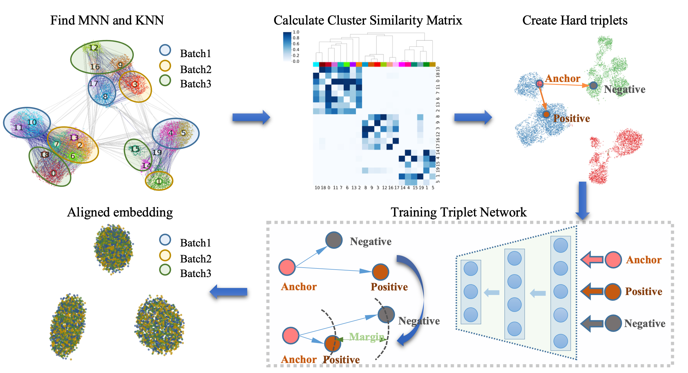

# scDML_reproduce

## Overview
scDML (Batch Alignment of **s**ingle **c**ell transcriptomics data using **D**eep **M**etric **L**earning) is designed for single cell transcriptomics data's clustering, which is a deep learning model based on [deep metric learning](https://kevinmusgrave.github.io/pytorch-metric-learning) to remove batch effect, guided by the initial clusters and MNN information intra and inter batches. In this manuscript, we proposed a strategy to merge initial clusters successively that takes batch effect into consideration, by computing the number of KNN pairs intra batch and MNN pairs inter batches, then calculating the similarity of clusters, and finally constructing a hierarchical tree, in which the root of the tree is the unique cluster obtained after gathering all clusters, and the leaves are the clusters to be merged. Thereafter, we used the above MNNs to guide information for building better low-dimensional embeddings. In this way, this procedure guarantees that scDML outperforms existing methods in terms of merging the same cell types, separating different cell types and preserving cell types unique to some batches.

This repository is dedicated to providing the code used to perform all evaluations in the scDML paper.It includes code used to generate results for scDML,and for every competing method. The scDML method's repository can be found [https://github.com/eleozzr/scDML](https://github.com/eleozzr/scDML)

## Compared Methods

Here we compared 9 popular methods with scDML. 

| Method    | version | URL                                                          | Reference                |
| --------- | ------- | ------------------------------------------------------------ | ------------------------ |
| FastMNN   | 1.10.0  | https://bioconductor.org/packages/release/bioc/html/batchelor.html | (Lun Aaron, 2019)        |
| Harmony   | 0.1.0   | https://github.com/immunogenomics/harmony                    | (Korsunsky et al., 2019) |
| Seurat 3  | 4.1.1   | https://satijalab.org/seurat/                                | (Stuart et al., 2019)    |
| Liger     | 1.0.0   | https://github.com/welch-lab/liger                           | (Welch et al., 2019)     |
| INSCT     | 0.0.2   | https://github.com/lkmklsmn/insct                            | (Simon et al., 2021)     |
| BERMUDA   | -       | https://github.com/txWang/BERMUDA                            | (Wang et al., 2019)      |
| BBKNN     | 1.5.1   | https://github.com/Teichlab/bbknn                            | (Polański et al., 2020)  |
| Scanorama | 1.7.2   | https://github.com/brianhie/scanorama                        | (Hie et al., 2019)       |
| scVI      | 0.8.1   | https://github.com/scverse/scvi-tools                        | (Lopez et al., 2018)     |
| CarDEC    | 1.0.3   | https://github.com/jlakkis/CarDEC                            | (Lakkis et al, 2021)     |

## Directory description

- `Method_script`: python script or R script for different methods  
- `Bash_script`: bash script to run all methods on a dataset  
- `data_used`: all data analyzed in scDML manuscript. Here we only provide two datasets [Mammary epithelial cells (bct_raw.zip)](./data_used/bct_raw.zip) and  [macaque_retina (macaque_raw.zip)](./data_used/macaque_raw.zip). And the full dataset will be available from [https://doi.org/10.6084/m9.figshare.20499630.v2](https://doi.org/10.6084/m9.figshare.20499630.v2)).

- `Method_evaluation`: jupyter notebooks of evaluation for all methods on different datasets.

# Reference 

Hie,B. **et al.** (2019) Efficient integration of heterogeneous single-cell transcriptomes using Scanorama. **Nat. Biotechnol.**, **37**, 685–691.

Korsunsky,I. **et al.** (2019) Fast, sensitive and accurate integration of single-cell data with Harmony. **Nat. Methods**, **16**, 1289–1296.

Lopez,R. **et al.** (2018) Deep generative modeling for single-cell transcriptomics. **Nat. Methods**, **15**, 1053–1058.

Lun Aaron (2019) A description of the theory behind the fastMNN. **https://marionilab.github.io/FurtherMNN2018/theory/description.html**.

Polański,K. **et al.** (2020) BBKNN: fast batch alignment of single cell transcriptomes. **Bioinformatics**, **36**, 964–965.

Simon,L.M. **et al.** (2021) Integration of millions of transcriptomes using batch-aware triplet neural networks. **Nat. Mach. Intell.**, **3**, 705–715.

Stuart,T. **et al.** (2019) Comprehensive Integration of Single-Cell Data. **Cell**, *177*, 1888-1902.e21.

Wang,T. **et al.** (2019) BERMUDA: a novel deep transfer learning method for single-cell RNA sequencing batch correction reveals hidden high-resolution cellular subtypes. **Genome Biol.**, **20**, 165.

Welch,J.D. **et al.** (2019) Single-Cell Multi-omic Integration Compares and Contrasts Features of Brain Cell Identity. **Cell**, ***\*177\****, 1873-1887.e17.

Lakkis J, **et al.** (2021) A joint deep learning model enables simultaneous batch effect correction, denoising, and clustering in single-cell transcriptomics. **Genome Res**. 31(10):1753-1766.

